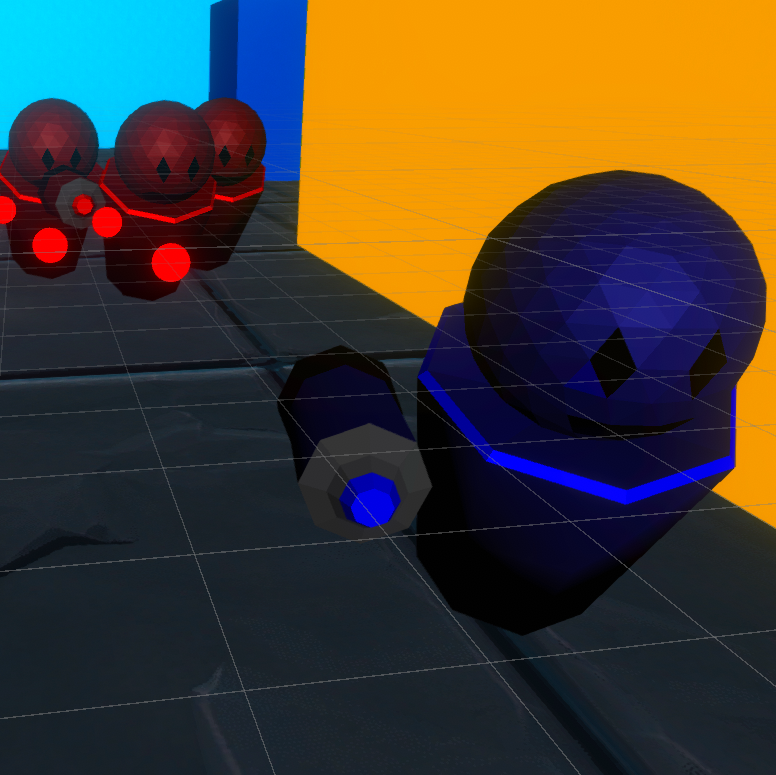
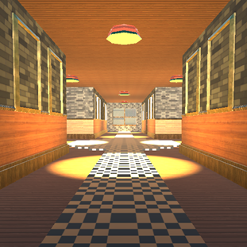
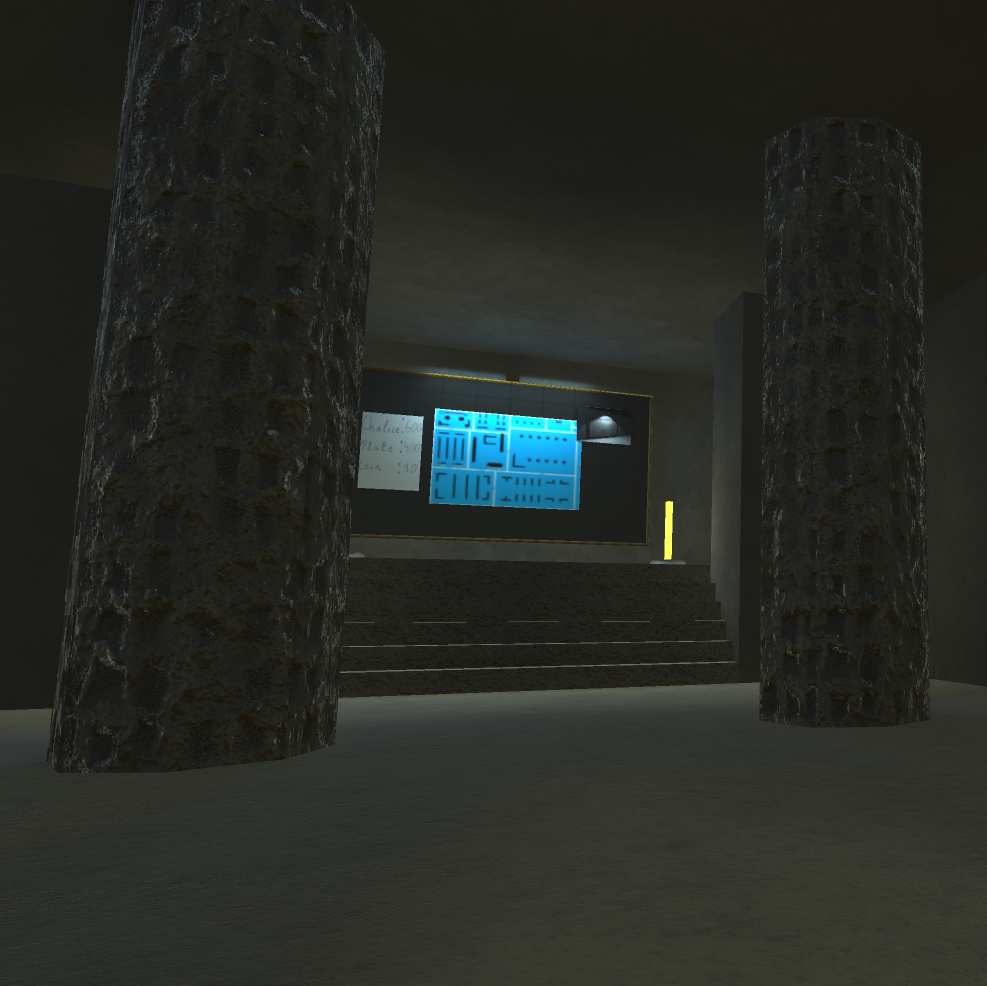

# Caolan Maher's GitHub

<link href="style.css" rel="stylesheet">

## Welcome to My Website

You can use the [editor on GitHub](https://github.com/CaolanMaher/Website/edit/gh-pages/index.md) to maintain and preview the content for your website in Markdown files.

## About Me

 Sample Text 

## Projects I Have Worked On

### RoboStorm

PLACEHOLDER

This is a game I made with a fellow college student for Brackeys Game Jam.

You play as robot who has to fight off other robots in a chaotic hellstorm.

Pick up abilities that spawn around the map, but be careful as these abilities can be

positive or negative for you or the enemies.

### Manic Mansion

This was a college project that I worked on with 2 fellow students

You play as a man whose car has broken down at the side of the road

You search for anyone who might he able to help and come across a large

mansion surrounded by trees.

You decide to walk in in hopes of finding someone who can help you.

The house is empty but you find a large crystal upstairs.

You decide to investigate the crystal but end up breaking it.

You must find all the pieces of the crystal to put it back together

in order to leave the house.

### Thief

### Finding Rachael

This is a game I made with two

### The Haunting Maze
PLACEHOLDER
