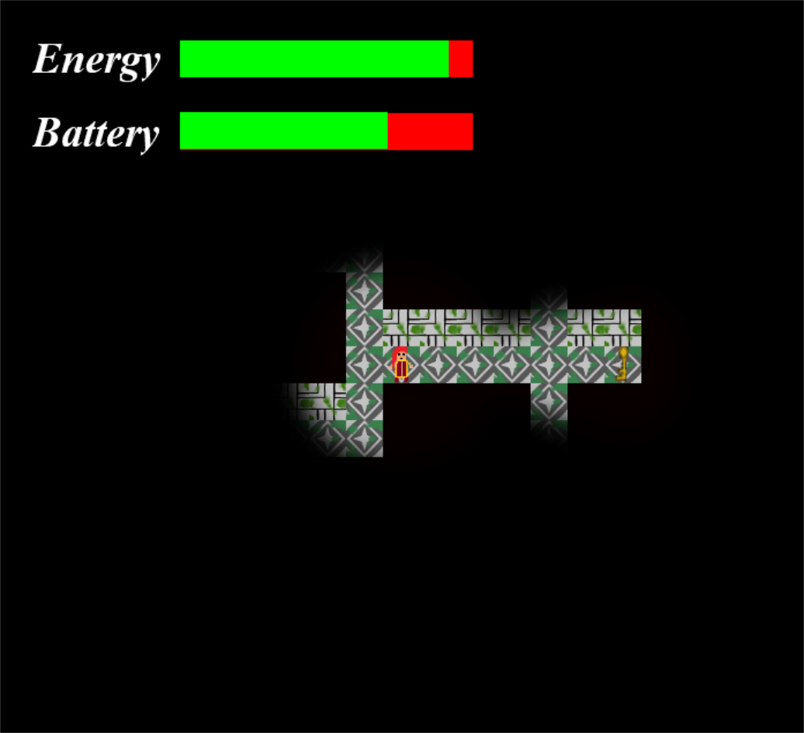

<!DOCTYPE html>
<html lang="en-US">
  <head>
    <meta charset="UTF-8">

<!-- Begin Jekyll SEO tag v2.7.1 -->
<title>Caolan Maher’s GitHub | Website</title>
<meta name="generator" content="Jekyll v3.9.0" />
<meta property="og:title" content="Caolan Maher’s GitHub" />
<meta property="og:locale" content="en_US" />
<link rel="canonical" href="https://caolanmaher.github.io/Website/" />
<meta property="og:url" content="https://caolanmaher.github.io/Website/" />
<meta property="og:site_name" content="Website" />
<meta name="twitter:card" content="summary" />
<meta property="twitter:title" content="Caolan Maher’s GitHub" />

<!-- End Jekyll SEO tag -->

    <link rel="preconnect" href="https://fonts.gstatic.com">
    <link rel="preload" href="https://fonts.googleapis.com/css?family=Open+Sans:400,700&display=swap" as="style" type="text/css" crossorigin>
    <meta name="viewport" content="width=device-width, initial-scale=1">
    <meta name="theme-color" content="#157878">
    <meta name="apple-mobile-web-app-status-bar-style" content="black-translucent">
    <link rel="stylesheet" href="/Website/assets/css/style.css?v=dee66bee145af8f29055f0b9bd4040cd44ff54e7">
    <!-- start custom head snippets, customize with your own _includes/head-custom.html file -->

<!-- Setup Google Analytics -->

<!-- You can set your favicon here -->
<!-- link rel="shortcut icon" type="image/x-icon" href="/Website/favicon.ico" -->

<!-- end custom head snippets -->

  </head>
  <body>
    <a id="skip-to-content" href="#content">Skip to the content.</a>

    <header class="page-header" role="banner">
      <h1 class="project-name">Caolan Maher’s GitHub</h1>
      <h2 class="project-tagline"></h2>
      
        <a href="https://github.com/CaolanMaher/Website" class="btn">View on GitHub</a>
      
      
    </header>

    <main id="content" class="main-content" role="main">
      <h1 id="caolan-mahers-github">Caolan Maher’s GitHub</h1>

<link href="style.css" rel="stylesheet" />

<h2 id="welcome-to-my-website">Welcome to My Website</h2>

<h2 id="about-me">About Me</h2>

<a href="modules.md">Modules Page</a>

 Sample Text 

<h2 id="projects-i-have-worked-on">Projects I Have Worked On</h2>

<h3 id="robostorm">RoboStorm</h3>

This is a game I made with a fellow college student for Brackeys Game Jam.

You play as robot who has to fight off other robots in a chaotic hellstorm.

Pick up abilities that spawn around the map, but be careful as these abilities can be positive or negative for you or the enemies.

 

<h3 id="manic-mansion">Manic Mansion</h3>

This was a college project that I worked on with 2 fellow students

You play as a man whose car has broken down at the side of the road

You search for anyone who might he able to help and come across a large mansion surrounded by trees.

You decide to walk in in hopes of finding someone who can help you.

The house is empty but you find a large crystal upstairs.

You decide to investigate the crystal but end up breaking it.

You must find all the pieces of the crystal to put it back together to leave the house.

 

<h3 id="thief">Thief</h3>

This is a game I created with a fellow student for Summer Game Jam 2021

You play as a up-and-coming thief trying to make it big by making his very heist a big one. Your job is to steal the treasured piece of art present in the art gallery.

You will have to be careful and stealthy as a wide range of guards will be patrolling the area ready to capture you if you stumble.

 

<h3 id="finding-rachael">Finding Rachael</h3>

This is a game I made with two fellow students for Ludum Dare 48

You play as a park ranger who got a report about a missing child.

You head to the park to search for the child called Rachael.

While searching through the park you find portals leading to different dimensions.

Traverse through these dimensions to find Rachel and get her home safely.

 

<h3 id="the-haunting-maze">The Haunting Maze</h3>

This is a game I made with a fellow student for the Dublin Game Jam 2021

You are trapped in a maze with a roaming ghost.

You must find all the keys in the maze to unlock the door to escape.

If the ghost finds you, he will chase you down. If he catches you, you die and have to restart.

      <footer class="site-footer">
        
          <a href="https://github.com/CaolanMaher/Website">Website</a> is maintained by <a href="https://github.com/CaolanMaher">CaolanMaher</a>.
        
        This page was generated by <a href="https://pages.github.com">GitHub Pages</a>.
      </footer>
    </main>
  </body>
</html>
